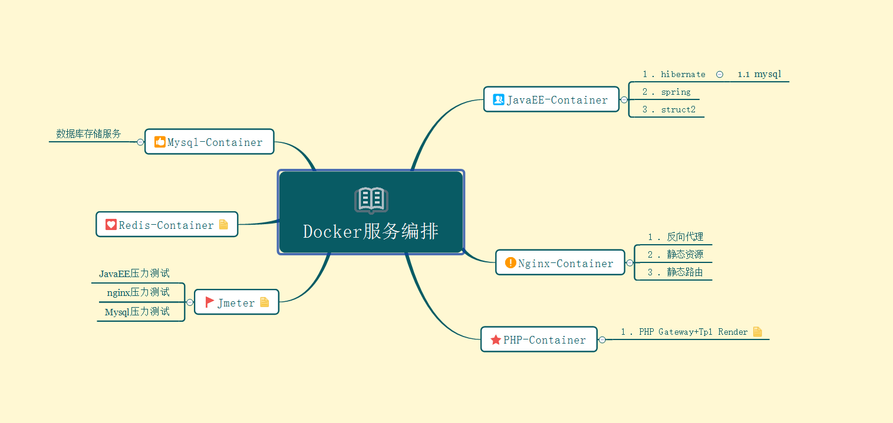
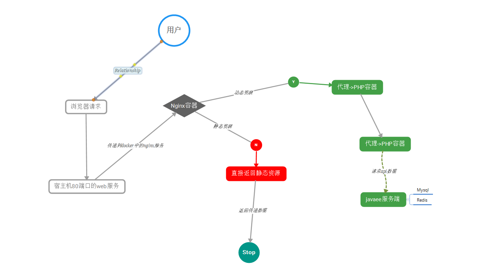
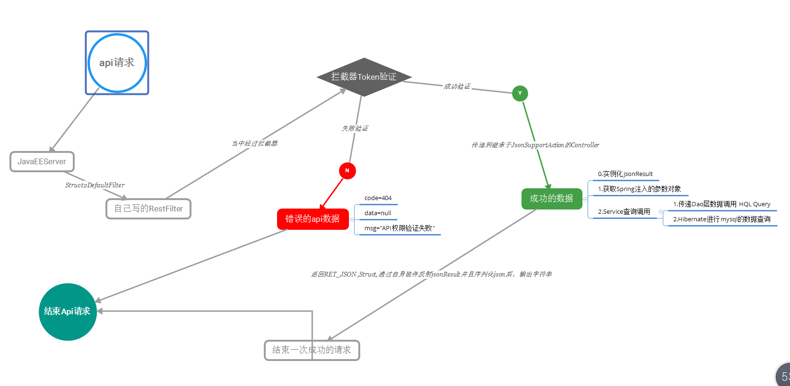

## 系统架构图





## 包含容器
- php容器
- nginx容器
- maven容器
- jenkins容器
- redis容器
- node容器
- mysql容器

## 包含模块子项目
- 爬虫模块Node（https://github.com/zhaojunlike/nodejs-meizitu）
- php前台页面渲染模块
- javaEE服务端模块（struct2+spring+hibernate）


## Author@   Godtoy


## Usage
1.git clone ${url}

2.docker-compose up --build


## 第一次需要手动导入测试数据


1.查看docker-compose 网络

```
$docker network ls
NETWORK ID          NAME                  DRIVER              SCOPE
eb94c90c4aae        30goinghome_default   bridge              local
70e90a580013        bridge                bridge              local
92abe5bb5b5e        host                  host                local
4e85e7e6b5f3        none                  null                local

```

2.查看backup真实路径
```
$ pwd
```

3.导入默认得数据
//启动一个迁移数据容器
```shell
$ docker run -it --link mysql-db:mysql --network ${network} -v `pwd`/data/backup:/data/backup:ro --rm mysql:5.7 sh -c 'exec mysql -h"mysql" -P"3306" -uroot -p"zhaojun" package_v1</data/backup/default.sql'docker run -it --link mysql-db:mysql --network 30goinghome_default -v `pwd`/data/backup:/data/backup:ro --rm mysql:5.7 sh -c 'exec mysql -h"mysql" -P"3306" -uroot -p"zhaojun" package_v1</data/backup/default.sql'
```


## 开发

## 线上环境

## 持续集成和持续交付

## 预览